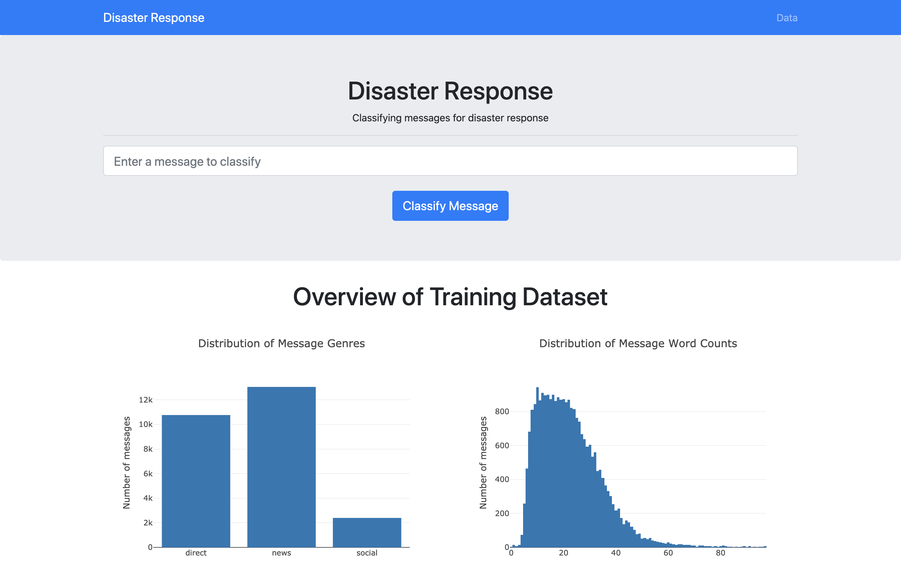
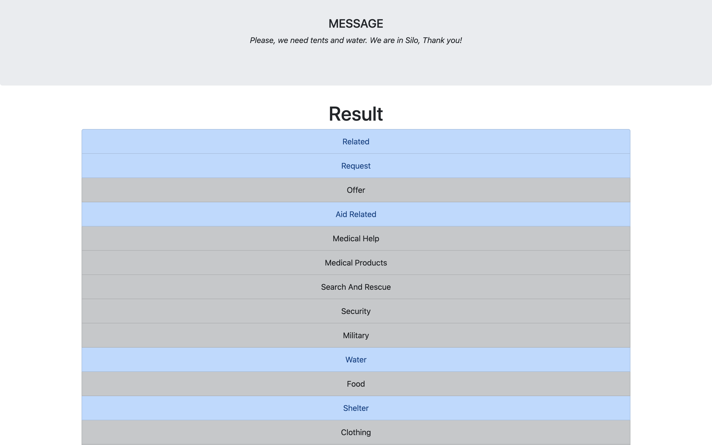

# Disaster Response
Disaster response organizations receive millions of messages following a disaster and because different organizations take care of different parts of the problem, there needs to be a way of directing messages to the appropriate organization so that they can respond to the problem accordingly. 
This web application was built to classify disaster messages so that an emergency professional would know which organization to send the message to.
The application uses a classifier that was trained on the data described below. 
See my [article](https://medium.com/analytics-vidhya/building-a-text-classifier-for-disaster-response-caf83137e08d) for a walkthrough of the project.

## Data
The [data](https://appen.com/datasets/combined-disaster-response-data/) contains 26,248 labeled messages that were sent during past disasters around the world, such as a 2010 earthquake in Haiti and a 2012 super-storm (Sandy) in the U.S..
Each message is labeled as 1 or more of the following 36 categories:  

<pre>
'related', 'request', 'offer', 'aid_related', 
'medical_help', 'medical_products',
'search_and_rescue', 'security', 'military', 
'child_alone', 'water', 'food', 'shelter', 
'clothing', 'money', 'missing_people', 'refugees', 
'death', 'other_aid', 'infrastructure_related', 
'transport', 'buildings', 'electricity', 'tools', 
'hospitals', 'shops', 'aid_centers', 
'other_infrastructure', 'weather_related', 
'floods', 'storm', 'fire', 'earthquake', 'cold', 
'other_weather', 'direct_report'
</pre>

None of the messages in the dataset were labeled as `child_alone` so this category was removed altogether before building the classifier, leaving 35 categories to classify.

## Classifier

#### Pipeline

To classify these 35 categories, this application uses a machine learning pipeline with the following steps:

1. Tf-idf vectorizer - tokenizes an entire corpus of text data to build a vocabulary and converts individual documents into a numeric vector based on the vocabulary

	- Tokenizer steps: lowercase all characters > remove all punctuation > tokenize text into individual words > strip any white space surrounding words > remove stopwords > stem remaining words
	- Vectorizer steps: convert a text document into a term frequency vector (word counts) > normalize word counts by multiplying the inverse document frequency

2. Multi-output classifier using a logistic regression model - predicts 35 binary labels (0 or 1 for each of the 35 categories) 

#### Results

The classifier was evaluated on a test dataset with the following results:

- Average accuracy: 0.9483  
- Average precision: 0.9397  
- Average recall: 0.9483  
- Average F-score: 0.9380

I also tried Naive Bayes and random forest models, but they didn't perform as well as the logistic regression model.
The random forest model had slightly better metrics for a lot of the categories, but since it takes significantly longer to train, I opted for logistic regression.

Naive Bayes metrics:
- Average accuracy: 0.9417  
- Average precision: 0.9331  
- Average recall: 0.9417  
- Average F-score: 0.9346  

Random forest metrics:
- Average accuracy: 0.9480  
- Average precision: 0.9420  
- Average recall: 0.9480  
- Average F-score: 0.9429  

## Getting Started

#### Setup

1. Make sure Python 3 is installed

2. Navigate to the project's root directory in the terminal

3. Run the following command to install the project requirements:
    `pip install -r requirements.txt`

4. Run the following commands to set up the database and model:

    - To run the ETL pipeline that cleans and stores the data:
        `python data/process_data.py data/disaster_messages.csv data/
        disaster_categories.csv data/messages.db`
    - To run the ML pipeline that trains and saves the classifier:
        `python models/train_classifier.py data/messages.db models/classifier.pkl`

5. Navigate to the project's `app/` directory in the terminal

6. Run the following command to run the web app:
    `python run.py`

7. Navigate to http://127.0.0.1:3001/ in the browser

#### Files

- `app/`
    - `run.py` - This script runs the Flask web application and renders the web pages in the `templates/` directory
    - `templates/`
        - `index.html` - Home page of the website, which contains (1) an input field to enter a message to classify and (2) a data dashboard that summarizes the data that the classifier was trained on
        - `result.html` - Result page of the website, which displays the 35 classification results of the message that was entered into the input field
        
- `data/`
    - `process_data.py` - This script runs the ETL pipeline, which imports data from both csv files, merges and cleans the data, and loads it into a SQLite database
    - `disaster_messages.csv` - Text data, which includes the original text, translated English text, and the message genre (how the message was received)
    - `disaster_categories.csv` - Target labels, which includes binary values to indicate which of the 36 categories each message is labeled as

- `models/`
    - `train_classifier.py` - This script runs the machine learning pipeline, which imports the clean data from the database created by the `process_data.py` script, splits that data into a training and test set, instantiates and trains the model (described above) on the training set, evaluates the model on the test set, and saves the model as a pickle file
    
- `notebooks/`
    - `etl_pipeline.ipynb` - This notebook shows the code exploration for the `process_data.py` script
    - `ml_pipeline.ipynb` - This notebook shows the code exploration for the `train_classifier.py` script
    - `dashboard_visuals.ipynb` - This notebook shows the code exploration for the dashboard visualizations on the home page
    
- `requirements.txt` - list of required Python packages

- `pip_env.txt` - list of pip-installed packages after pip-installing the `requirements.txt` file

#### Interface - Home Page

#### Interface - Result Page

## License
This repository is licensed under a [Creative Commons Attribution License](https://creativecommons.org/licenses/by/4.0/).
